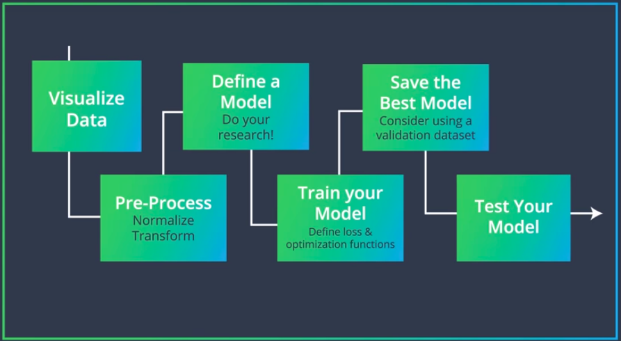
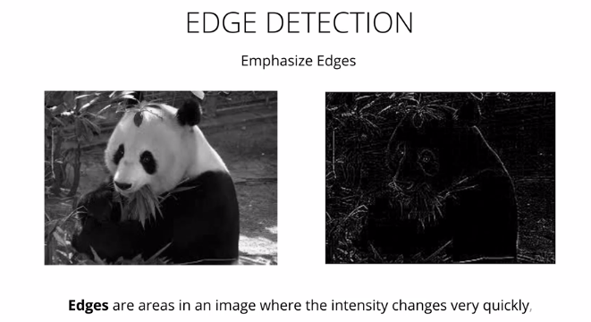
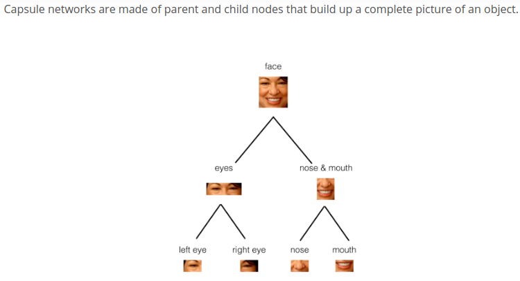

## Lesson 6: CNN

### MLP:
- Working with **MNIST** Dataset (basics)
- Important steps are flattening and **Normalization**(/255)
- The distribution of such data should resemble a Gaussian function centered at zero. For image inputs we need the pixel numbers to be positive, so we often choose to scale the data in a normalized range [0,1].
- Search codes for hidden layer and nodes numbers intuition
- MLP model training the MNIST Dataset (2 ff layers) (Videos 12-13)
- Explore various kinds of Loss functions and optimizers
- Training and Validation and Test sets
- Validation set in code (Video 15, uses subset random sampler and keeps saving the minimum validation loss model; but not stopping training)
- The pipeline:

### CNN
From Video 17: CNNS
- drawbacks of MLP: 
	- flattening removes spatial information
	- fully connected creates too many parameters
- CNNs:
	- CNNs use sparsely connected layers
	- will accept the image as is as a matrix
- CNNs try to find patterns in a local region (kernel sized region) and pass this on to the next layers
- frequency in images means `rate of change of intensity`. i.e, the places where intensity changes abrupty(stripes), the frequency is high.
- `highpass filters` act like edge detectors.

- It is important for edge detection that all the elements of the kernel/filter sums to `0`. Otherwise the filtered image will be weighted and will have the effect o brightening or darkening the entire filtered image.
- Edge Handling: Kernel convolution relies on centering a pixel and looking at it's surrounding neighbors. So, what do you do if there are no surrounding pixels like on an image corner or edge? Well, there are a number of ways to process the edges, which are listed below. It’s most common to use padding, cropping, or extension. In extension, the border pixels of an image are copied and extended far enough to result in a filtered image of the same size as the original image.
	- _Extend:_ The nearest border pixels are conceptually extended as far as necessary to provide values for the convolution. Corner pixels are extended in 90° wedges. Other edge pixels are extended in lines.
	- _Padding:_ The image is padded with a border of 0's, black pixels.
	- _Crop:_ Any pixel in the output image which would require values from beyond the edge is skipped. This method can result in the output image being slightly smaller, with the edges having been cropped.
- For a `n-d` input image, the filter will also have to be `n-d`. All elements of the `n-d` filter is summed. And the output `d` will be number of filters used.
- Video 29: **CIFAR** CNN solution
- Pooling:
	- max pooling
	- average pooling
	- _capsule network:_ there has been research into classification methods that do not discard spatial information (as in the pooling layers), and instead learn to spatial relationships between parts (like between eyes, nose, and mouth). Each capsule outputs a vector with some magnitude and orientation. 
- Video 34: General CNN architecture pipeline overview
- http://cs231n.github.io/convolutional-networks/#conv
- *Important** 35: CNN layers _code_ in pytorch + size and parameter calculations. Picture in `images/conv_details.png`
- _Image Augmentation_: If we want to detect and object in an image, we want our model to be:
	- rotation invariant: any rotation of the image should not matter
	- translation invariant: where the object is doesn't matter
	- scale invariant: size of the onject shouldn't matter
For this we should perform data augmentation so our model can see all variations of an image and our model can be more robust. This also prevents overfitting.
- Lots of **resources** for CNN visualizations(42-43)
- Ways to visualize CNNs:
	- visuallize the activation maps(see what filtering is doing)
	- constructing images that maximize activations of a filter
