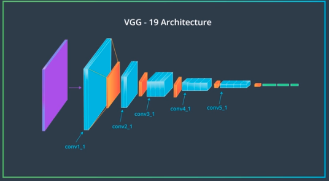
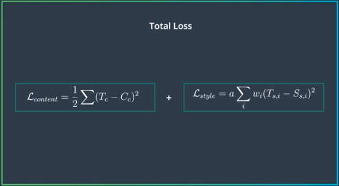

## Style Transfer
- Later layers of CNN are referred to as content representation of an image because the deeper layers, the less the background information and the more the information of the content.
- But how can we isolate the style of an image? In any convolutional layer, the different filters extract different features. We find the correlation among the different filters, that represents the style of the image. But it should leave out information about the actual arrangement and identity of the object in the image.
- Features from deeper CNN layers will give us the content, features from shallower layers will give us the style of the image.
- As we form our new target image, we will compare its content representation(from the deeper CNN layer) with the content representation of the content image. This is the content loss. **content loss = MSE content representations**. We change only the target image to minimize this loss.
- Style refers to how similar the features in a single layer are. We take out these similarities from multiple layers of different sizes and make a _multi-scale_ style representation. 
- We have a set of feature maps(= #of filters) when an image passes through a convolutional layer. First we vectorize the feature maps. So we turn a feature map of size 4x4x8(which was a 4x4 image convolved with 8 filters) into 16x8 matrix. Then we multiply itself with its transpose. **gram matrix = AAT**. This operation treats each value in the feature map as an individual value, unrelated to surrounding values. So the resultant gram matrix contains unlocalized information. Each value of the gram matrix indicates the similarities between every pair of filter outputs/feature maps.
- **style loss = MSE of style and target image gram matrices** of all pair gram matrices computer from different convolutional layers. The MSE of each convolutional layer is weighted, thereby changing how much each layer will have an impact on our final target image. 
- **Loss = Content loss + Style loss**. Then we use typical backpropagation to change the target image and reduce the loss. 
- Since the 2 losses will be calculated differently the values will be pretty different. But we want our target image to take both into account fairly equally. **Loss = alpha*Content loss + beta*Style loss**. In practice, this means beta >> alpha, i.e **alpha/beta** is smaller. If this ratio is too small, we will only see style and not much content. This ratio will be different for different kinds of images.
- The style loss for each image is also **normalised** b the number of elements in that layer (d*w*h)
- Reminder: we use pretrained models and DO NOT update the model(freeze it). We update the target image.
- https://github.com/udacity/deep-learning-v2-pytorch/tree/master/style-transfer

